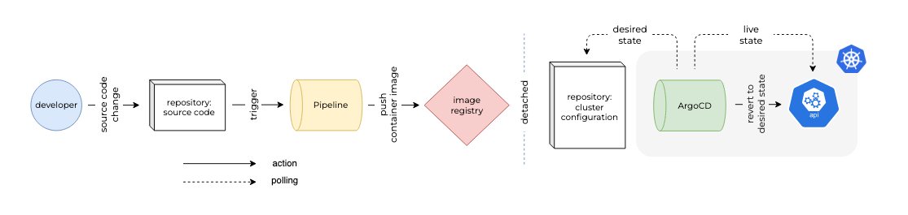
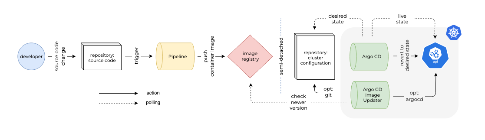

## title: 

Extending GitOps: Effortless continuous integration and deployment on Kubernetes

## introduction:

Over the last decade, there have been notable shifts in the process of delivering source code. One of the more recent adaptations on the deployment aspect of this process has been the declarative and version controlled description of an application's desired infrastructure state and configuration - commonly referred to as 'GitOps'. This approach has gained popularity in the context of cloud-native applications and container orchestration platforms, such as Kubernetes, where managing complex, distributed systems can be challenging.

As this desired state is off declarative nature, it points to a specific/static version of that application. Which has great advantages, namely the fact that it makes it easy to roll back to a previous state, audit changes before they are made and maintain a reproducible setup. But how do we move to a newer version of an application without the need for manual version adjustments?

This is where Argo CD Image Updater comes in, it will verify if a more recent version of a container image is available, subsequently triggers the necessary updates of the applicable Kubernetes resources and optionally reflects these changes in the assosciated version control.

## overview:

Prior to diving into the technical implementation, let's establish an overview of the GitOps process and highlight the role of Argo CD Image Updater within this process.

#### default gitops

The first part of process starts with a developer modifying the source code of the application and pushing the changes back to the version control system. Subsequently, this action initiates a workflow or pipeline that both constructs and assesses the application. The outcome is an artifact in the form of a container image, which is subsequently pushed to an image registry.

In a second - detached - part of the process, the cluster configuration repository is the single source of truth regarding the the _desired state_ of the application configuration. Argo CD will periodically monitor the Kubernetes cluster to see if the _live state_ differs from the _desired state_. When there is a difference, depending on the synchronisation strategy Argo CD will try to revert back to the _desired state_.



#### extended gitops

Compared to the default process, in this extended variant another Argo CD component is added to the Kubernetes cluster. The Argo CD Image Updater component will verify if a more recent version of a container image exists within the image registry. If such version is identified, the component will either directly or indirectly update the running application. In the next section we'll delve into the configuration options for the Argo CD Image Updater aswell as the implementation of the component.



## configuration:

Before the technical implementation we'll familiarize ourself with the configuration options Argo CD Image Updater provides. This configuration can be found in two concepts, the `write back method` and `update strategy`. Both have options tailored to specific situation, so it is good to understand what the options are and how that equates to the technical implementation.

#### write back method

At the moment of writing Argo CD Image Updater supports two methods of propagating the new versions of the images to Argo CD. These methods also refered to as _write back_ methods are `argocd` & `git`. 

- `argocd`: This default _write back_ method is pseudo-persistent - when deleting an application or synchronizing the configuration in version control, any changes made to an application by Argo CD Image Updater will be gone - making it best suitable for imperatively created reasources. This default method doesn't require additional configuration.

- `git`: The other _write back_ method is the persistent/declarative option, when the a more recent version of a container image is identified, Argo CD Image Updater will store the parameter override along the application's resource manifests. It will store the override in a file named `.argocd-source-<application-name>.yaml`, reducing the risk of a merge conflict in the application's reouces manifests. To change the _write back_ method the an annotation needs to be set on the Argo CD `Application` resource. In addition the branch the to commit back to can optionally be changed from the default value `.spec.source.targetRevision` of the application.

    From an audit trail and a reproducible perspective, this is the desired option. It provides us with the option to have automatic continuous deployment, while keeping these aspects that GitOps is known for.

    ```yaml
    argocd-image-updater.argoproj.io/write-back-method: git
    ```

> [!NOTE]
> When using the `git` write back method, credentials configured for Argo CD will be re-used. A dedicated set of credentials can be provided, this and more configuration can be found in the [documentation](https://argocd-image-updater.readthedocs.io/en/stable/basics/update-methods).

#### update strategies

In addition to the choice of which write back method to use we need to decide on a update strategy. This strategy defines how Argo CD Image Updater finds new versions of an image that is to be updated. Currently four methods are supported; `semver`, `latest`, `digest`, `name`. 

Before looking at their respective differences, we'll need to know what `mutable` and `immutable` image tags are. A mutable repository has tags that can be overwritten by a newer image, where as when a repository configuraiton states that tags must be immutable - it can't be overwritten by a newer image. From the options below each options expects _immutable_ tags to be used, if a mutable _tag_ is used the _digest_ strategy should be used.

- `semver`: Updates the application to the latest version of an image in an image registry while taking into consideration semantic versioning constraints - following the format `X.Y.Z`, where `X` is the major version, `Y` is the minor version and `Z` the patch version. The option can be configured to only bump, to newer minor or patch versions - it also supports pre-release versions through additional configuration. In the example below the application would be updated with newer patch version of the application, but not upgrading when a newer minor or major version is present.

    ```yaml
    argocd-image-updater.argoproj.io/<alias>.update-strategy: semver
    argocd-image-updater.argoproj.io/image-list: <alias>=<repository-name>/<image-name>[:<version_constraint>]
    ```

- `latest`: Updates the application with the image that has the most recent build date. When a specific build has multiple tags Argo CD Image Updater will pick the lexically descending sorted last tag in the list. Optionally if you want to consider only certain tags, an annotation with a regular expression can be used. Similarly an annotation can be used to ignore a list of tags.

    ```yaml
    argocd-image-updater.argoproj.io/<alias>.update-strategy: latest
    argocd-image-updater.argoproj.io/image-list: <alias>=<repository-name>/<image-name>
    ```

- `digest`: Updates the application based on a change for a muttable tag within the registry. When this strategy is used image digests will be used for updating the application, so the image on the cluster for `<repository-name>/<image-name>:<tag_name>` will appear as `<repository-name>/<image-name>@sha256:<hash>`.

    ```yaml
    argocd-image-updater.argoproj.io/<alias>.update-strategy: digest
    argocd-image-updater.argoproj.io/image-list: <alias>=<repository-name>/<image-name>:<tag_name>
    ```

- `name`: Updates the application based on a lecixal sort of the image tags and uses the last tag in the sorted list. Which could be used when using date/time for tagging images. Similar to the latest strategy, a regular expression can be used to consider only specific tags.

    ```yaml
    argocd-image-updater.argoproj.io/<alias>.update-strategy: name
    argocd-image-updater.argoproj.io/image-list: <alias>=<repository-name>/<image-name>
    ```

## implementation:

We'll start out by creating two repositories as can been seen within the overview, a `source code` and a `cluster configuration` repository. Theoretically both could be housed in the same repository, but a seperation of concerns is advised. 

The next step would be to setup the continuous integration pipeline to create the artifact, i.e. container image, that will be used as a starting point in the continuous deployment process. In this walkthrough we'll use GitHub for our repository aswell as GitHub Actions for our pipeline. However this setup can be made in most popular version control/pipeline options.

#### continuous Integration workflow

Within the source code repository under ther `.github/worksflows/` directory we'll create a GitHub actions workflow, which we name `continuous-integration.yaml`. This workflow will consist of checking out the source code, building the container image and pushing it to the GitHub Packages Image registry.

```yaml
name: continuous-integration

on:
  push:
    branches: ["main"]
  pull_request:
    branches: ["main"]

env:
  REGISTRY: ghcr.io
  IMAGE_NAME: ${{ github.repository }}

jobs:
  build-and-push:
    name: build and push container image
    runs-on: ubuntu-latest
    
    permissions:
      contents: read
      packages: write

    steps:
      - name: checkout source code
        uses: actions/checkout@v4

      - name: authenticate with repository
        uses: docker/login-action@v3
        with:
          registry: ghcr.io
          username: ${{ github.actor }}
          password: ${{ secrets.GITHUB_TOKEN }}

      - name: image metadata
        uses: docker/metadata-action@v4
        id: meta
        with:
          images: "${{ env.REGISTRY }}/${{ env.IMAGE_NAME }}"
          tags: |
            type=sha,prefix=sha-
            type=ref,event=pr,prefix=pr-
            type=ref,event=tag,prefix=tag-
            type=raw,value=${{ github.run_id }},prefix=gh-
            type=raw,value=${{ github.ref_name }}
            type=raw,value=latest,enable=${{ github.ref_name == 'main' }}

      - name: build and push
        uses: docker/build-push-action@v5
        with:
          context: .
          push: true
          tags: ${{ steps.meta.outputs.tags }}
          labels: ${{ steps.meta.outputs.labels }}
```

For simplicity sake the image registry is made public so that additional authentication from within the cluster isn't needed. You can discover a detailed tutorial on how to make a GitHub Package public [here](https://docs.github.com/en/repositories/managing-your-repositorys-settings-and-features/managing-repository-settings/setting-repository-visibility). If you prefer utilizing a private repository, refer to [this](https://kubernetes.io/docs/tasks/configure-pod-container/pull-image-private-registry/) guide to enable pulling from the private repository within the cluster.

#### cluster configuration

For our application's Kubernetes resources we'll create a Helm chart. In the cluster configuration repository, under the charts directory run the following command:

```bash
helm create <application-name>
```

```
  charts/<application-name>
    ├── .helmignore   # patterns to ignore when packaging Helm charts.
    ├── Chart.yaml    # information about your chart
    ├── values.yaml   # default values for your templates
    ├── charts/       # chart dependencies
    └── templates/    # template files
        └── tests/    # test files
```


## demonstration:

#### argo cd authentication

We'll start by setting up our Kubernetes cluster, for this demonstration a local cluster will be used, created through minikube. After installing minikube the following command can be ran to start the cluster:

```bash
minikube start
```

The next step would be to setup Argo CD within the cluster, this can be done by running the following commands:

```bash
kubectl create namespace argocd
```

```bash
kubectl apply -n argocd -f https://raw.githubusercontent.com/argoproj/argo-cd/stable/manifests/install.yaml
```

To get access to the running Argo CD instance we can use port-forwarding to connect to the api server without having to expose the service:

```bash
kubectl port-forward svc/argocd-server -n argocd 8080:443
```

An initial password is generated for the admin account and stored under the `password` field in a secret named `argocd-initial-admin-secret`. Use this to login with the `username` value `admin` and change the password for the user in the 'User Info' . Another safer option would be to use SSO.

```bash
kubectl -n argocd get secret argocd-initial-admin-secret -o jsonpath="{.data.password}" | base64 -d
```

Now that we hve access to the Argo CD user interface, we'll look at the configuration of Argo CD Applications.

#### argocd configuration

The next step would be to configure Argo CD to start managing the application's Kubernetes resources. This can be done in an imperative or declarative manner. For this demonstration we'll configure the Argo CD application declaratively. Lets look at the following manifest:

```yaml
apiVersion: argoproj.io/v1alpha1
kind: Application
metadata:
  name: <application-name>
  namespace: argocd
  finalizers:
    - resources-finalizer.argocd.argoproj.io
spec:
  project: default
  source:
    repoURL: https://github.com/<organization-name>/<repository-name>.git
    targetRevision: HEAD
    path: charts/<application-name>
  destination:
    server: https://kubernetes.default.svc
    namespace: <application-name>
```

```yaml
apiVersion: argoproj.io/v1alpha1
kind: Application
metadata:
  name: bookstore
  namespace: argocd
  finalizers:
    - resources-finalizer.argocd.argoproj.io
spec:
  project: default
  source:
    repoURL: https://github.com/amplication/blog-cluster-configuration.git
    targetRevision: HEAD
    path: charts/bookstore
  destination:
    server: https://kubernetes.default.svc
    namespace: bookstore
```

Apply this configuration against the cluster by using the following command:

```bash

```

## conclusion:

